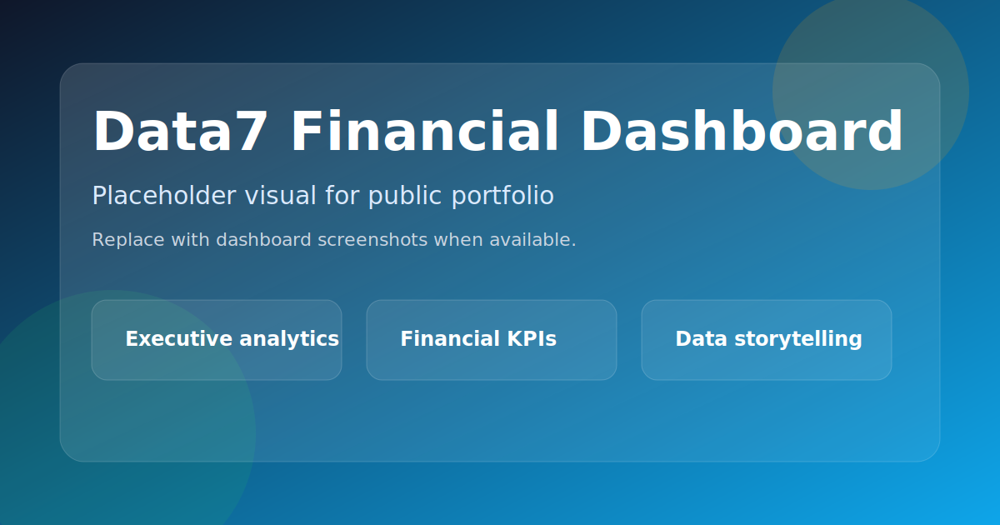
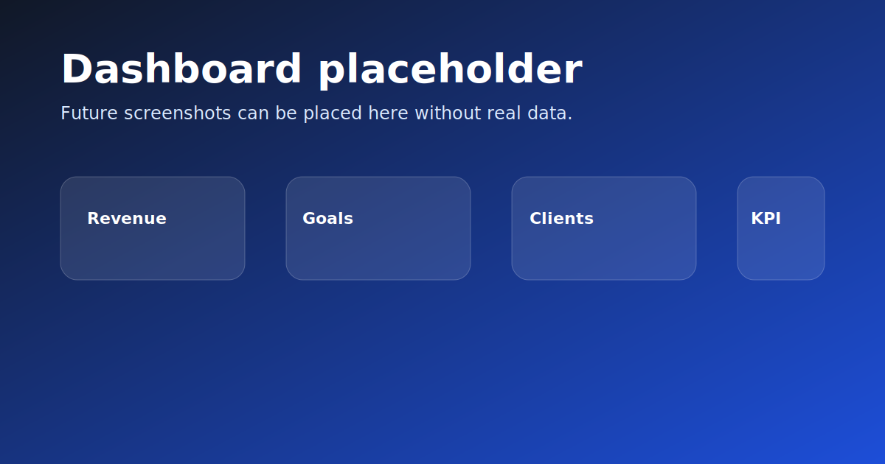

# Data7 Financial Dashboard




Dashboard financeiro em Python para transformar dados operacionais em indicadores executivos, com foco em receita, metas, clientes e performance gerencial.

---

## Visão geral

O Data7 Financial Dashboard organiza dados de negócio em uma camada visual clara para apoiar análise rápida de faturamento, produtividade e evolução de performance.

É um projeto voltado para leitura gerencial, acompanhamento de metas e visão consolidada de resultado.

---

## Problema de negócio

Em muitas operações, dados importantes ficam espalhados em planilhas, consultas e relatórios desconectados. Isso dificulta:

- leitura rápida do desempenho;
- acompanhamento de metas;
- comparação entre períodos;
- análise de clientes;
- tomada de decisão executiva.

---

## Solução desenvolvida

O dashboard consolida indicadores de faturamento e operação em uma interface visual pensada para leitura de gestores e times analíticos.

---

## Funcionalidades principais

- Faturamento diário, semanal e mensal
- Evolução de receita por período
- Meta vs realizado
- Ranking de clientes
- Ticket médio por operação
- Indicadores de produtividade
- Tendências e comparativos históricos
- Visualização executiva em dashboard

---

## Tecnologias utilizadas

- Python
- Streamlit
- SQL
- PostgreSQL
- Pandas
- Plotly

---

## Impacto estimado

- Mais velocidade na leitura dos resultados
- Visão clara de metas e performance
- Menor dependência de planilhas dispersas
- Melhor acompanhamento comercial e financeiro
- Tomada de decisão mais objetiva

---

## Demonstrações visuais



Os visuais desta pasta são placeholders e não expõem dados reais.

---

## Segurança e privacidade

- Sem exposição de dados sensíveis
- Sem credenciais no repositório
- Sem planilhas reais no material público
- Estrutura adequada para vitrine pública e demonstração de capacidade técnica

---

## Próximos passos

- Expandir os indicadores gerenciais
- Melhorar filtros e navegação analítica
- Aumentar a profundidade das análises por período e por cliente
- Evoluir a experiência visual do dashboard

---

## Como executar

```bash
git clone https://github.com/FxNunesDev/data7-financial-dashboard.git
cd data7-financial-dashboard
pip install -r requirements.txt
streamlit run app.py
```

---

## Estrutura do projeto

```text
app.py
requirements.txt
/sql
/data
/images
/assets
```